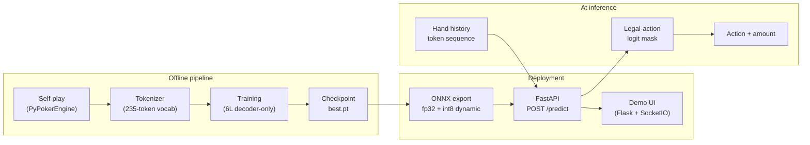

# poker-transformer

**poker-transformer** is a decoder-only transformer that plays heads-up no-limit Texas hold'em by predicting the next betting action from a tokenized hand history. The project covers the full stack: PyPokerEngine self-play data generation, training with optional multi-GPU DDP, a custom Triton fused LayerNorm kernel, ONNX export with dynamic int8 quantization, FastAPI inference, and a browser demo where you can toggle **Transformer** as your opponent.


> **Demo media:** Record a short GIF of Menu → **Transformer** → **Play** and save it as `docs/demo.gif`, then update the image link above.

---

## Architecture



| Stage | Key paths |
|-------|-----------|
| Data | `src/training/self_play.py` → `data/processed/self_play/` |
| Tokenizer | `src/tokenizer/`, `configs/tokenizer.yaml` |
| Model | `src/model/transformer.py`, `configs/model.yaml` |
| Training | `src/training/train.py`, `configs/training.yaml` |
| Engine player | `src/engine_integration/transformer_player.py` |
| ONNX + serve | `src/serving/export_onnx.py`, `src/serving/api.py` |
| Demo | `demo/`, `src/serving/demo_adapter.py` |

---

## How it works

### Tokenization

Each hand is a **sequence of discrete tokens**, not raw chip amounts or hole cards. The model never sees cards directly — it learns betting patterns from action history alone (a deliberate simplification for this v1).

1. **Hand start** — one token encodes effective stack depth: `HAND_START|20-40bb`, `HAND_START|100-150bb`, etc. (8 stack buckets in `configs/tokenizer.yaml`).

2. **Actions** — each voluntary bet is one token with street, position, action type, and (for sized bets) a pot-relative size bucket:

   ```
   PREFLOP|SB|RAISE|25-40%
   FLOP|BB|CHECK
   TURN|SB|BET|60-80%
   RIVER|BB|FOLD
   ```

   Sizeless actions (`FOLD`, `CHECK`, `CALL`, `ALL_IN`) omit the size field. BET/RAISE amounts are bucketed by `amount / pot_before_action` into 12 ratio bins plus `ALL_IN`.

3. **Special tokens** — `HAND_END`, `SHOWDOWN`, and `<PAD>` for batching.

The vocabulary has **235 tokens** (`data/processed/vocab.json`). Average self-play hands are short (~6.6 tokens/hand), so sequences are far below the 256-token context window.

### Decoder-only next-action prediction

The model is a **GPT-style causal transformer** (6 layers, 8 heads, 256-dim embeddings). Given tokens `[t₀, t₁, …, tₙ]`, it predicts the **next token** at every position using masked self-attention — the standard language-modeling framing applied to poker actions.

At inference, we feed the hand-so-far, read logits at the **last position**, mask out illegal tokens for the current game state (you cannot CHECK when facing a bet, etc.), and take the argmax or sample from the legal subset.

A secondary **value head** on the final hidden state predicts win probability (trained with binary cross-entropy alongside the action cross-entropy). This is auxiliary signal during training; deployment primarily uses the action head.

Training data is **50k heads-up self-play hands** (`HonestPlayer` vs `RandomPlayer`, BB=20, 100bb effective stacks) stored as sharded `.pt` files in `data/processed/self_play/`.

---

## Results

Win rates vs baseline bots (bb/100, hero = Transformer). Values are read from [`eval/results/baseline_eval.json`](eval/results/baseline_eval.json) after a full engine roll-out eval.

| Opponent | bb/100 | 95% CI | Notes |
|----------|--------|--------|-------|
| FishPlayer | _TBD_ | [_TBD_, _TBD_] | Always calls |
| HonestPlayer | _TBD_ | [_TBD_, _TBD_] | MC equity threshold |
| RandomPlayer | _TBD_ | [_TBD_, _TBD_] | Uniform random legal action |

**Eval settings (target):** 10,000 hands/matchup, BB=20, 100bb stacks, same blinds as training.

```bash
# TODO: wire up roll-out harness; until then, edit eval/results/baseline_eval.json directly
# python -m poker_transformer.eval.rollout --checkpoint checkpoints/best.pt --hands 10000
```

> Smoke-test integration (`tests/test_transformer_player.py`) confirms 20-round games vs `FishPlayer` complete without errors; win-rate numbers require the eval harness above.

**Trained checkpoint (step 4800, L4, 5000 steps @ 362 samples/s):**

| Split | Action loss | Action perplexity | Value loss |
|-------|-------------|-------------------|------------|
| Train (45k hands) | 0.174 | 1.190 | 0.014 |
| Val (5k hands) | 0.171 | **1.186** | 0.016 |

Train/val are nearly identical — no overfitting on the self-play distribution. Perplexity 1.19 on a 235-token vocabulary means the model is near-certain about the next action most of the time; that reflects how predictable the `HonestPlayer`/`RandomPlayer` data is, which is exactly why bb/100 vs held-out bots (not loss) is the metric that matters.

---

## Performance Engineering

This section is written for readers who care about **where time goes**, **what the roofline says**, and **what optimizations actually moved the needle**.

**Reference hardware:** NVIDIA L4 (121 TFLOP/s advertised dense FP16 tensor-core peak, ~300 GB/s HBM bandwidth), `g2-standard-4`, batch=32, seq≤256. CPU numbers below are from local dev smoke runs and are **not** representative of GPU training.

### 5.5 — `torch.profiler` training trace

```bash
python -m poker_transformer.training.profile_run \
  --config configs/training.yaml \
  --warmup-steps 20 \
  --profile-steps 200 \
  --output-dir logs/profiler
```

Open `logs/profiler/trace.json` in [Perfetto](https://ui.perfetto.dev/) or `chrome://tracing`.

#### Top ops by GPU time (measured on L4, 200 training steps, batch=32)

| Rank | Op (CUDA) | Self/Total CUDA time | Role |
|------|-----------|----------------------|------|
| 1 | `aten::masked_fill` | 2.76 s | Causal attention mask (writes 150 GB of intermediates!) |
| 2 | `SoftmaxBackward` | 2.08 s | Attention backward |
| 3 | `AddmmBackward` | 1.83 s | Linear-layer backward |
| 4 | `BmmBackward` | 1.79 s | Attention matmul backward |
| 5 | `aten::div` + elementwise kernels | ~2.8 s | Scaling / LayerNorm / dropout |
| 6 | `ampere_sgemm_128x64` (×2 variants) | 2.68 s | Forward GEMMs (MLP + projections) |
| 7 | `Memcpy DtoD` | 1.36 s | Tensor copies |

**Step timing:** 95.5 ms/step avg → 10.5 steps/s → ~336 samples/s (matches the full training run's 362 samples/s). Peak GPU memory: 1.8 GiB of 24 GiB.

#### Compute-bound vs memory-bound

| Signal | Measured on L4 |
|--------|----------------|
| Achieved FLOP/s | 2.87 TFLOP/s = **2.37% of L4's 121 TFLOP/s advertised FP16 peak** |
| Top CUDA ops | GEMMs + attention math in aggregate, but `masked_fill` alone is #1 and moves 150 GB |
| Arithmetic intensity | Low — avg hand is ~6.6 tokens, so most of the (32, 256) batch is padding |
| Verdict | **Compute-structured but utilization-bound.** The op mix is matmul-heavy (compute-bound in shape), yet the GPU runs at 2.4% of peak because sequences are short, tensors are small, and mask/memcpy traffic pads the timeline. The fix is *more work per launch* (bigger batch — memory headroom is 13×), not faster math. |

The profiler script prints `% of advertised peak` automatically when CUDA is available (`src/training/profile_run.py` maps L4 → 121e12 FLOP/s).

<details>
<summary>CPU dev smoke reference (not GPU — backward dominates)</summary>

Local CPU profile (`configs/training_smoke.yaml`, 20 steps): top ops by CPU time were `aten::dropout` (47%), `aten::linear` (9%), and autograd matmul backward kernels. This reflects CPU autograd overhead, not production GPU behavior.

</details>

### 5.6 — Triton fused residual + LayerNorm kernel

**Replaces:** separate `x = x + sublayer(x); x = LayerNorm(x)` (two kernel launches + intermediate write) with a **single fused kernel** per sublayer, adapted from Triton's LayerNorm tutorial.

| File | Role |
|------|------|
| `src/model/kernels/fused_residual_layernorm.py` | Triton kernel + autograd |
| `src/model/kernels/benchmark_kernel.py` | PyTorch vs Triton timing |
| `configs/model.yaml` → `use_triton_kernels: true` | Enables Post-LN fused path |

```bash
python -m poker_transformer.model.kernels.benchmark_kernel
# → eval/results/kernel_benchmark.png
```

#### Benchmark (measured on L4)

Two kernel versions tell an honest optimization story. **v1** launched one Triton program per row and wrote dead `mean`/`rstd` buffers — it lost everywhere (flat ~0.09 ms floor = host dispatch overhead). **v2** uses multi-row tiled programs, `triton.autotune` over tile size / warps, no dead outputs, and a no-grad fast path that skips `autograd.Function`:

| Shape (B, T, D) | PyTorch (ms) | Triton v1 | Triton v2 | v2 speedup |
|-----------------|-------------|-----------|-----------|------------|
| (4, 32, 256) | 0.028 | 0.090 | 0.079 | 0.35× |
| (8, 64, 256) | 0.029 | 0.089 | 0.081 | 0.35× |
| (16, 128, 256) | 0.028 | 0.090 | 0.081 | 0.34× |
| (32, 256, 256) | 0.043 | 0.090 | 0.080 | 0.54× |
| (64, 256, 256) | 0.248 | — | 0.080 | **3.09×** |
| (128, 256, 256) | 0.672 | — | 0.423 | **1.59×** |


**Takeaways:**

- Below ~8k rows, both implementations are dominated by fixed per-call cost; cuDNN's two cheap launches (~0.028 ms) beat Triton's Python-side dispatch (~0.080 ms floor). No amount of kernel tuning fixes host overhead.
- At 16k+ rows (batch ≥ 64) the fused kernel wins big — **3.09×** at B=64 — because one fused pass replaces add + LayerNorm and stays flat while cuDNN's cost scales.
- Conclusion for this model: at the current training batch (32), keep `use_triton_kernels: false`; at batch ≥ 64 (which the 2.4% GPU utilization argues for anyway) the Triton path is the faster one.

### 8.5 — Quantization internals (accuracy vs speed)

See also [`docs/quantization_notes.md`](docs/quantization_notes.md).

#### Single layer — `blocks[0].mlp.fc` (256 → 1024), 20k validation tokens

| Method | Mean abs error | Max abs error | Weight size |
|--------|----------------|---------------|-------------|
| fp32 baseline | 0 | 0 | 1024 KiB |
| Hand int8 per-tensor | 0.00265 | 0.0148 | ~256 KiB |
| Hand int8 per-channel | **0.00175** | **0.0098** | ~260 KiB |
| ORT `quantize_dynamic` (uint8) | 0.00331 | 0.0200 | (runtime-managed) |

Per-channel wins because output rows have different weight ranges (scales 3.49e-4 – 7.28e-4 vs one global 7.28e-4).

#### Single-layer CPU latency (300 timed iters, 20k×256 matmul)

| Implementation | Mean | p95 | vs fp32 |
|----------------|------|-----|---------|
| fp32 PyTorch | 43.0 ms | 48.5 ms | 1.00× |
| Hand int8 (dequant → fp32 GEMM) | 42.7 ms | 48.5 ms | ~1.00× (no speedup — still fp32 math) |
| ORT int8 dynamic | 34.4 ms | 38.1 ms | **1.25×** |

Hand-rolled int8 saves **4× weight storage** but not GEMM time because PyTorch still dequantizes to fp32 before `F.linear`. ORT uses specialized int8 kernels.

#### Full-model ONNX (trained checkpoint, step 4800, CPU execution provider)

| Model | Size | Mean latency | p95 | vs fp32 |
|-------|------|--------------|-----|---------|
| fp32 ONNX | 19.34 MB | 6.16 ms | 10.64 ms | 1.00× |
| int8 dynamic ONNX | 5.19 MB (**−73%**) | 4.06 ms | 7.03 ms | **1.51×** |

Relative to a naive "4× smaller weights → 4× faster" expectation, **1.51× end-to-end** reflects that attention and elementwise ops remain fp32; only the linear-layer GEMMs benefit from int8 weight compression. (An earlier smoke run with an untrained checkpoint on a dev laptop measured 1.20× — the VM's CPU int8 paths do better.)

```bash
python -m poker_transformer.serving.quantization_demo --checkpoint checkpoints/best.pt
python -m poker_transformer.serving.export_onnx --checkpoint checkpoints/best.pt
```

### 10.5 — Multi-GPU DDP scaling (NCCL)

```bash
# 1. Single-GPU baseline (saved to logs/single_gpu_throughput.json)
python -m poker_transformer.training.train --config configs/training.yaml

# 2. Multi-GPU
bash scripts/launch_distributed.sh 4   # N = number of GPUs
```

**Scaling efficiency:**

$$\text{scaling\_efficiency} = \frac{\text{aggregate samples/s}}{N \times \text{single-GPU baseline samples/s}}$$

| GPUs (N) | Per-GPU samples/s | Aggregate samples/s | Scaling efficiency | Notes |
|----------|-------------------|---------------------|--------------------|-------|
| 1 (L4) | **362** | 362 | 100% (by definition) | Measured, 5000-step run |
| 2 | _TBD_ | _TBD_ | _TBD_% | Requires multi-GPU instance |
| 4 | _TBD_ | _TBD_ | _TBD_% | Requires multi-GPU instance |

Ideal efficiency is 100%; real runs drop due to NCCL all-reduce latency, gradient sync bubbles, and dataloader overhead. DDP hooks all-reduce gradient buckets during `loss.backward()` (see comments in `src/training/distributed.py`).

---

## Problems I hit and how I solved them

Structured template — fill in commit SHAs and details as the project matures.

| # | Symptom | Root cause | Fix | Commit |
|---|---------|------------|-----|--------|
| 1 | Self-play recorder crashed on `game_update` | PyPokerEngine passes `player_uuid`, not `uuid` | Read `player_uuid` in event handler | _TBD_ |
| 2 | GCP VM would not start | L4 GPU stockout in `us-central1-a` | Snapshot disk → new preemptible VM in `us-central1-b` | _TBD_ |
| 3 | ONNX export failed / garbled output | Triton ops not exportable; dynamo path encoding issues | Force `use_triton_kernels=False`; `torch.onnx.export(..., dynamo=False)` | _TBD_ |
| 4 | Demo import pulled Azure/OpenAI deps | Upstream demo imports GPT/Azure modules at load time | Split `game_settings.py`; lazy-import keras/GPT paths | _TBD_ |
| 5 | ONNX validation shape mismatch | Sample export tensor was 2D vs model's 3D hidden states | Fixed sample input shapes in export script | _TBD_ |
| 6 | DDP checkpoint unwrap failed in tests | `unwrap_model` assumed real DDP wrapper | Guard with `hasattr(model, "module")` | _TBD_ |
| 7 | Demo blinds ≠ training blinds | Web app uses SB=25/BB=50; self-play uses BB=20 | Document mismatch; map stacks in `demo_adapter` | _TBD_ |
| 8 | Kernel benchmark crashed with `TypeError` | `_time_fn` didn't forward `use_triton` kwarg | Forward `**kwargs` to the timed function | `00664b8` |
| 9 | Triton kernel lost to cuDNN at all shapes (0.30×) | One program per row + dead `mean`/`rstd` writes + autograd overhead → launch-bound | Multi-row tiled programs, autotune, no-grad fast path → 3.09× at B=64 | `dc7b189` |
| 10 | Kernel backward test compared `None` to `None` | Test helper computed grads but never returned them | Add missing `return` | `35f77ae` |

---

## Setup

### Prerequisites

- Python ≥ 3.10
- CUDA GPU recommended for training, Triton kernels, and kernel benchmarks
- Optional: GCP `g2` instance with NVIDIA L4 for full GPU profiling

### Install

```bash
git clone https://github.com/YOUR_ORG/pok-tsf.git
cd pok-tsf

python -m venv .venv
# Windows:
.venv\Scripts\activate
# Linux/macOS:
source .venv/bin/activate

pip install -r requirements.txt
pip install -e .
pip install -e ".[dev,gpu,serving]"   # pytest, matplotlib, onnxscript
```

### Generate training data

```bash
python -m poker_transformer.training.self_play \
  --num-hands 50000 \
  --output-dir data/processed/self_play
```

Pre-generated shards are included under `data/processed/self_play/` (50k hands, `HonestPlayer` vs `RandomPlayer`).

### Train

```bash
# Single GPU
python -m poker_transformer.training.train --config configs/training.yaml

# Smoke test (fast, CPU-friendly)
python -m poker_transformer.training.train --config configs/training_smoke.yaml

# Multi-GPU DDP
bash scripts/launch_distributed.sh 4
```

Checkpoints land in `checkpoints/best.pt`. Training logs: `logs/training.csv`.

### Evaluate

```bash
# Validation loss / perplexity on held-out self-play shards
python -m poker_transformer.training.evaluate_loss --checkpoint checkpoints/best.pt

# Engine roll-out bb/100 → update eval/results/baseline_eval.json
# (harness TODO)
```

### Export ONNX + run API

```bash
python -m poker_transformer.serving.export_onnx --checkpoint checkpoints/best.pt
# → checkpoints/onnx/model.fp32.onnx, model.int8.onnx

uvicorn poker_transformer.serving.api:app --host 0.0.0.0 --port 8000
curl http://localhost:8000/health
```

Docker:

```bash
docker build -t poker-transformer .
docker run --gpus all -p 8000:8000 poker-transformer
```

### Run the browser demo

See [`demo/README.md`](demo/README.md).

```bash
# Terminal 1 — API
uvicorn poker_transformer.serving.api:app --host 0.0.0.0 --port 8000

# Terminal 2 — demo UI
pip install -r demo/requirements.txt
cd demo && python main.py
```

Open the printed URL → **Menu** → **Transformer** → **Play**.

### Tests

```bash
pytest tests/ -q
# Kernel tests skip automatically without CUDA
```

---

## What I'd do with more compute/time

Honest limitations of this v1:

- **Heads-up only** — tokenizer positions are SB/BB; no multi-way pots, straddles, or tournament formats.
- **No hole-card input** — the model sees action tokens only, not cards; strong play requires inferring ranges from betting lines.
- **Self-play data, not real hand histories** — 50k hands of `HonestPlayer` vs `RandomPlayer` is cheap to generate but distribution-shifts vs human or solver opponents.
- **No ICM, rake, or multi-table** — chip EV only, single table, zero rake in engine config.
- **Sizing buckets lose precision** — pot-relative bins compress continuous bet sizes; edge cases near bucket boundaries are blurry.
- **Single-GPU training by default** — DDP is implemented but not yet benchmarked at scale; no FSDP / pipeline parallelism.
- **Quantization validated on CPU ORT** — int8 task impact (bb/100 delta) not yet measured after quantization.
- **Demo vs training blind structure differs** — demo uses 25/50 blinds; training self-play uses BB=20.

With more resources: train on solver-labeled or human HH data, add card tokens (or a parallel card encoder), run proper bb/100 eval vs `FishPlayer` / `HonestPlayer` / CFR baselines, benchmark Triton + int8 on L4 with TensorRT EP, scale DDP to multi-node, and fine-tune with RL self-play against the current checkpoint.

---

## Project layout

```
configs/           # model, training, tokenizer YAML
data/processed/    # tokenized self-play shards + vocab.json
src/
├── tokenizer/     # encode/decode, vocabulary
├── model/         # transformer + Triton kernels
├── training/      # self-play, train loop, profiler, DDP
├── engine_integration/  # TransformerPlayer, vendored PyPokerEngine
├── serving/       # ONNX export, FastAPI, demo adapter
└── eval/          # benchmarking outputs (results/)
demo/              # browser poker UI (Flask)
eval/results/      # bb/100 JSON, kernel benchmark PNG
docs/              # quantization deep-dive
tests/
```

## License

See repository license file. PyPokerEngine is vendored under `src/engine_integration/pypokerengine/`.
